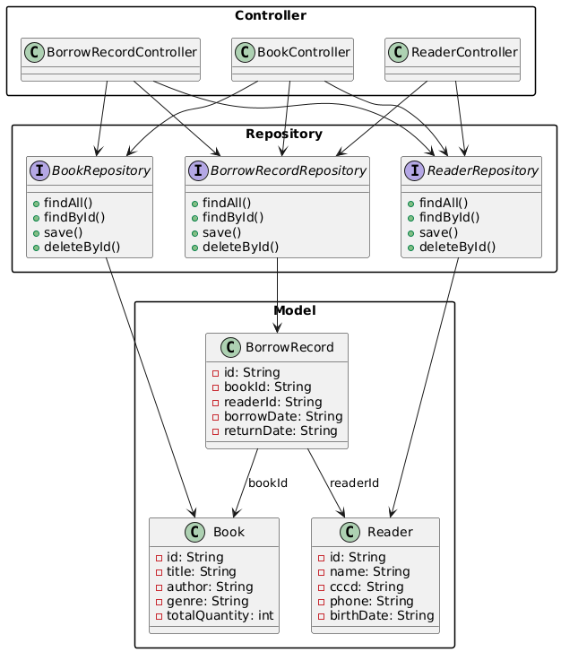
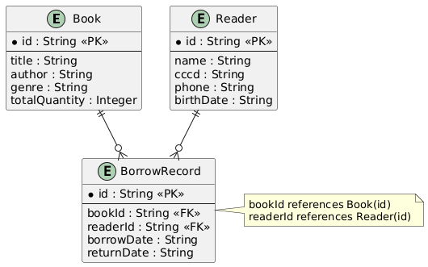
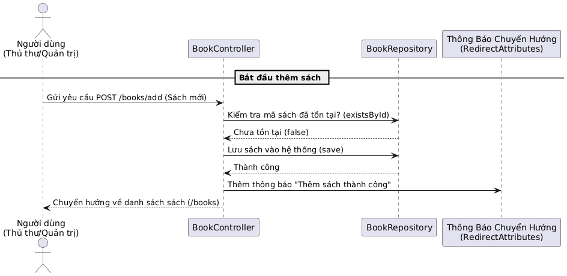
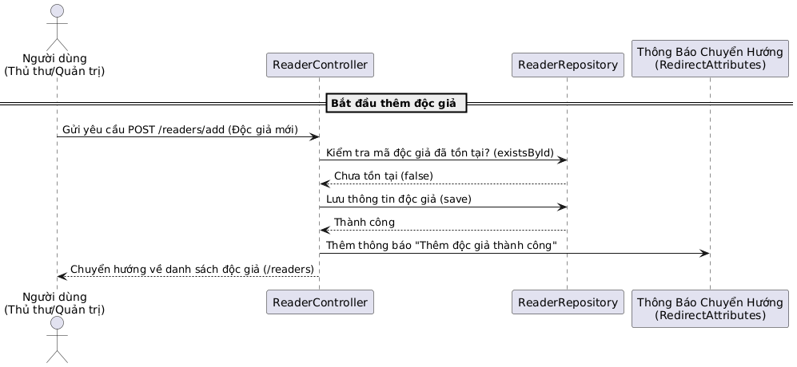
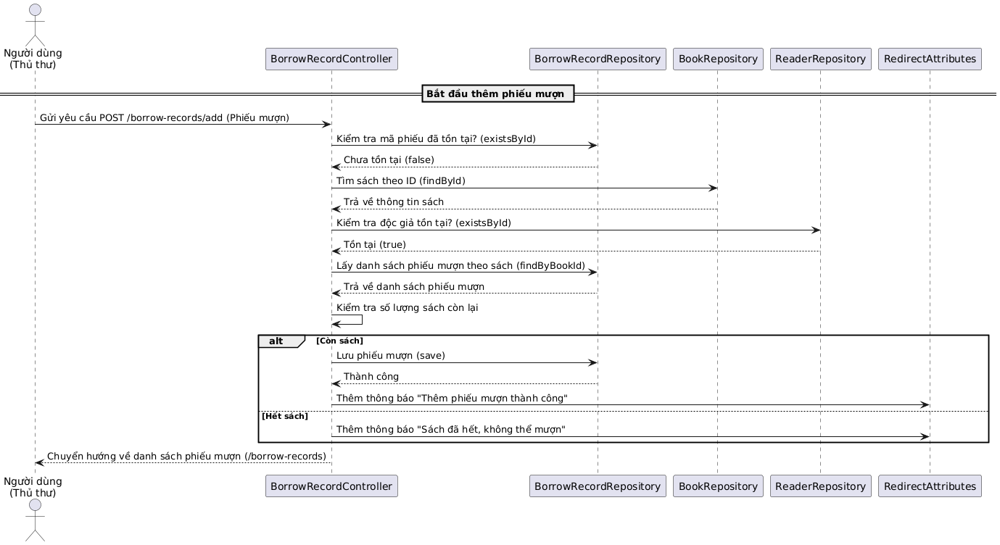
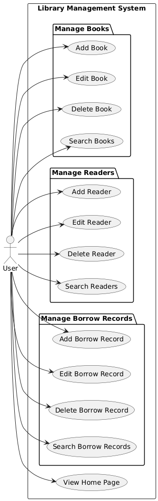

# HỆ THỐNG QUẢN LÝ THƯ VIỆN ĐẠI HỌC PHENIKAA

Ứng dụng web quản lý thư viện được phát triển với Spring Boot MVC, Thymeleaf và MySQL, cho phép quản lý sách, độc giả và phiếu mượn thông qua giao diện trực quan.

## Thông Tin Dự Án

- Tên dự án: Hệ Thống Quản Lý Thư Viện Đại học Phenikaa
- Nhóm thực hiện: Nhóm 16 - Khóa K17
- Trường: Đại học Phenikaa
- Học kỳ: Học kỳ 3 - Năm 2025

## Tính Năng Chính

- Tổng quan giao diện: Thống kê tổng số sách, sách đang mượn, sách còn lại, tổng số độc giả, tổng số phiếu mượn.
- Quản lý sách: Thêm, sửa, xóa, tìm kiếm theo tiêu đề.
- Quản lý độc giả: Thêm, sửa, xóa, tìm kiếm theo tên.
- Quản lý phiếu mượn: Thêm, sửa, xóa, tìm kiếm theo mã độc giả.
- Xác thực phiên đơn giản (phiên bản hiện tại chưa có đăng nhập).
- Kiểm tra tồn kho: Đảm bảo sách có sẵn trước khi tạo phiếu mượn.

## Thiết Kế Cơ Sở Dữ Liệu

**1. Reader (Độc giả)**
- id: String - Mã định danh độc giả (mã sinh viên)
- name: String - Họ và tên
- cccd: String - Số CCCD
- phone: String - Số điện thoại
- birthDate: String - Ngày sinh

**2. Book (Sách)**
- id: String - Mã định danh sách
- title: String - Tiêu đề sách
- author: String - Tác giả
- genre: String - Thể loại
- totalQuantity: Integer - Tổng số lượng sách trong kho

**3. BorrowRecord (Phiếu mượn)**
- id: String - Mã định danh phiếu mượn
- bookId: String - Mã sách (khóa ngoại)
- readerId: String - Mã độc giả (khóa ngoại)
- borrowDate: String - Ngày mượn
- returnDate: String - Ngày trả (ngày độc giả hẹn trả)

## Công Nghệ Sử Dụng

- Frontend: HTML, Thymeleaf
- Backend: Java, Spring Boot 2.7.18, Hibernate (Spring Data JPA)
- Cơ sở dữ liệu: MySQL
- Kiểm thử: JUnit 5, Mockito
- Quản lý biến môi trường: dotenv-java
- Quản lý mã nguồn: Git, GitHub
- IDE sử dụng: IntelliJ IDEA, Eclipse

## Kiến Trúc Dự Án

- Mô hình: MVC (Model - View - Controller)
- Controller: Xử lý yêu cầu HTTP
- Model: Các lớp thực thể Book, Reader, BorrowRecord
- Repository: Giao diện JPA kết nối với cơ sở dữ liệu
- Ứng dụng chính: OOPApplication khởi chạy hệ thống

## Cấu Trúc Thư Mục
```text
OOP_NO1_Term3_2025_K17_Group16/
├── src/
│ ├── main/
│ │ ├── java/com/example/
│ │ │ ├── controller/
│ │ │ │ ├── BookController.java
│ │ │ │ ├── ReaderController.java
│ │ │ │ └── BorrowRecordController.java
│ │ │ ├── model/
│ │ │ │ ├── Book.java
│ │ │ │ ├── Reader.java
│ │ │ │ └── BorrowRecord.java
│ │ │ ├── repository/
│ │ │ │ ├── BookRepository.java
│ │ │ │ ├── ReaderRepository.java
│ │ │ │ └── BorrowRecordRepository.java
│ │ │ └── OOPApplication.java
│ │ └── resources/
│ │ ├── templates/
│ │ │ ├── index.html
│ │ │ ├── books.html
│ │ │ ├── readers.html
│ │ │ └── borrow-records.html
│ │ └── application.properties
│ └── test/
│ └── java/com/example/controller/
│ ├── BookControllerTest.java
│ ├── ReaderControllerTest.java
│ └── BorrowRecordControllerTest.java
├── target/ (Tự động sinh bởi Maven)
├── pom.xml (Cấu hình Maven)
└── README.md
```
## Mô Hình Và Chức Năng

**Reader (Độc giả)**
- Thêm độc giả
- Sửa thông tin
- Xóa độc giả (nếu không có phiếu mượn liên quan)
- Tìm kiếm theo tên
- Hiển thị danh sách

**Book (Sách)**
- Thêm sách
- Sửa thông tin
- Xóa sách (nếu không có phiếu mượn liên quan)
- Tìm kiếm theo tiêu đề
- Hiển thị danh sách

**BorrowRecord (Phiếu mượn)**
- Thêm phiếu mượn (mỗi phiếu tương ứng với 1 sách được mượn)
- Sửa thông tin phiếu mượn
- Xóa phiếu mượn
- Tìm kiếm theo mã độc giả (mã sinh viên)
- Hiển thị danh sách

## Sơ Đồ Tổng Quan

- Class Diagram: Mối quan hệ giữa các lớp Book, Reader, BorrowRecord và các Repository, Controller tương ứng

- Sơ đồ ERD: Quan hệ dữ liệu giữa bảng Book, Reader và BorrowRecord

- Behavioral Diagram:
  - Sequence Diagram: Thêm sách, thêm độc giả, thêm phiếu mượn





  - Use Case Diagram: Quản lý sách, độc giả, phiếu mượn



## Xử Lý Lỗi Và Kiểm Thử

- Xử lý ngoại lệ với try-catch (ví dụ: sách hết, độc giả không tồn tại)
- Kiểm thử bằng JUnit và Mockito:
  - Hiển thị danh sách
  - Thêm, sửa, xóa sách, độc giả, phiếu mượn
  - Các trường hợp lỗi: thiếu thông tin, mã trùng, sách không còn tồn kho

## Hướng Dẫn Cài Đặt

**Yêu cầu:**
- JDK 11 trở lên
- MySQL 8.0 trở lên
- IDE: IntelliJ IDEA hoặc Eclipse

**Cài đặt:**

1. Clone dự án:
```text
git clone https://github.com/<your-repo>/OOP_NO1_Term3_2025_K17_Group16.git
cd OOP_NO1_Term3_2025_K17_Group16
```
2. Cấu hình cơ sở dữ liệu:
- Tạo database MySQL (ví dụ: `library_db`)
- Tạo `src/main/resources/application.properties`:
```text
spring.datasource.url=jdbc:mysql://localhost:3306/library_db
spring.datasource.username=<tên người dùng>
spring.datasource.password=<mật khẩu>
spring.jpa.hibernate.ddl-auto=update
```
3. Cấu hình biến môi trường:
- Tạo file `.env` tại thư mục gốc:
```text
DB_PASSWORD=<mật khẩu database>
```
4. Build và chạy ứng dụng:
```text
mvn clean install
mvn spring-boot:run
```
5. Truy cập ứng dụng tại: https://oop-n01-term3-2025-k17-group16.onrender.com/

6. Chạy kiểm thử:
## Thành Viên Nhóm

- Nguyễn Nhật Minh - 23010847 (*)
- Phạm Văn Minh - 23010550
- Phạm Ngọc Tiến - 23010010

## Phân Công Công Việc

| Thành viên       | Phân công                       | Chi tiết                          |
|------------------|---------------------------------|------------------------------------|
| Nguyễn Nhật Minh | Khởi tạo dự án, Dashboard, Book| Cấu trúc dự án, quản lý sách      |
| Phạm Văn Minh | Reader                         | Quản lý độc giả (CRUD, tìm kiếm)  |
| Phạm Ngọc Tiến | BorrowRecord                   | Quản lý phiếu mượn, kiểm tra tồn kho |

## Tài Liệu Tham Khảo

- Tài liệu Spring Boot
- Tài liệu Thymeleaf
- Tài liệu MySQL
- Tài liệu Hibernate ORM
- Maven Repository
- Java Documentation
- Tài liệu Git

## Phát Triển Trong Tương Lai

- Thêm tính năng đăng nhập, phân quyền
- Tích hợp xuất báo cáo PDF hoặc Excel
- Cải thiện giao diện với CSS, JavaScript (biểu đồ thống kê)
